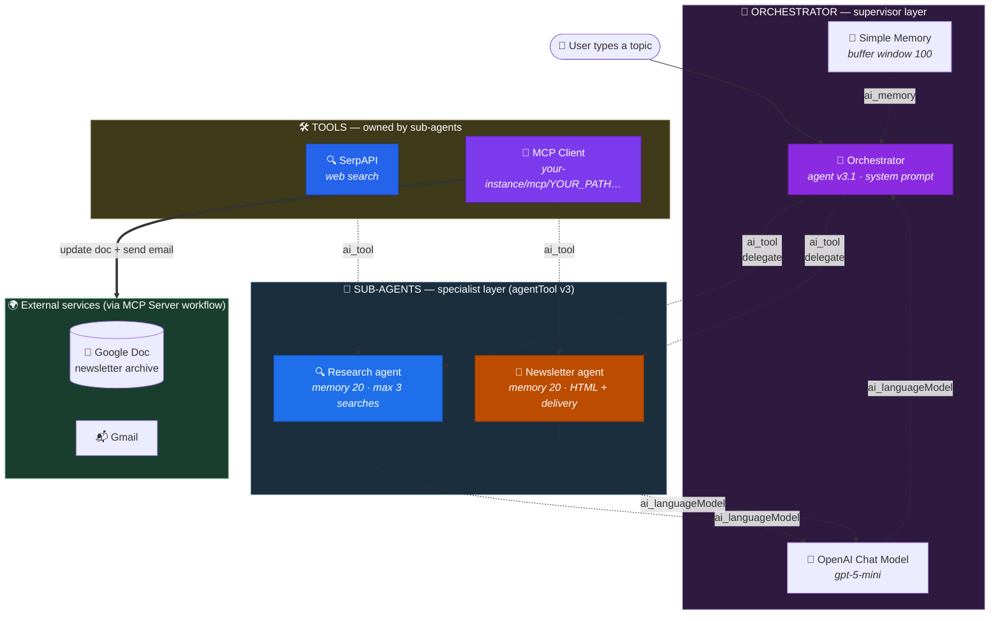
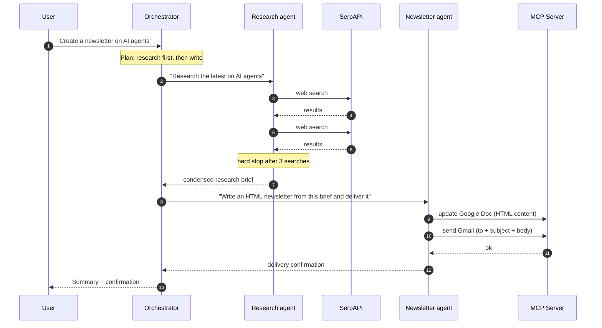

<div align="center">

# 📰 NextLeap — Multi-Agent System: Newsletter Agent

**A supervisor-style multi-agent system in n8n. One Orchestrator agent plans the job, then delegates to specialist sub-agents — a Research agent that searches the web, and a Newsletter agent that renders HTML, emails it, and updates a Google Doc — delivered over MCP.**

[](https://n8n.io)
[](https://n8n.io)
[](https://docs.n8n.io/integrations/builtin/cluster-nodes/)
[](https://modelcontextprotocol.io)
[](https://serpapi.com)
[](https://platform.openai.com)
[](LICENSE)

</div>

---

## 📖 Overview

This repository contains a single n8n workflow built during a **20-minute NextLeap AI workshop** on multi-agent systems.

**File:** [`Orchestrator pattern - Agent as tool.json`](Orchestrator%20pattern%20-%20Agent%20as%20tool.json)

### What it does

You type a topic. Behind the scenes:

1. **Orchestrator** reads the request and decides what needs to happen.
2. It calls the **Research agent**, which searches the web via SerpAPI and returns a condensed brief.
3. It calls the **Newsletter agent**, which turns that brief into polished HTML and delivers it two ways — **email via Gmail** and **archive to a Google Doc** — both over MCP.
4. The Orchestrator reports back.

One chat message in; a researched, formatted, delivered newsletter out.

### Why use multiple agents?

Because a single agent asked to research *and* write *and* format *and* send gets mediocre at all four. Splitting the work means each agent gets a **narrow system prompt, one job, and a small toolset** — which is exactly the condition under which LLMs perform best.

| Concern | Owned by |
| --- | --- |
| "What should we do, and in what order?" | Orchestrator |
| "What's the current information on this?" | Research agent |
| "How do we present and deliver it?" | Newsletter agent |

---

## 🧩 Which Multi-Agent Pattern Is This?

There are three common ways to build multi-agent systems. This repo implements the first.

| Pattern | How control flows | Best for | In n8n |
| --- | --- | --- | --- |
| **Orchestrator / Agent-as-Tool** ✅ | A top agent **delegates** to sub-agents as if they were tools | Fixed pipelines with clear stages | `agentTool` node |
| **Sequential chain** | Agent → output feeds the next agent, no decision-making | Strict step order, deterministic | Plain main connections |
| **Swarm / Handoff** | Agents **hand off** to each other, any agent can be active | Unpredictable paths, negotiation | Not natively supported |

### The defining trait of this repo

Sub-agents are connected to the Orchestrator via the **`ai_tool`** port — the exact same port used by tools like Gmail or Google Calendar.

> **That's the whole trick.** Because a sub-agent *is* a tool, the Orchestrator decides **when** to call it and **what to ask it** — via a natural-language prompt — while each sub-agent keeps its own private system prompt, memory, and tools that the Orchestrator never sees.

```
Orchestrator's view of the world:
  ├── 🔧 Research agent        (a tool)
  ├── 🔧 Newsletter agent      (a tool)
  ├── 🔧 SerpAPI               (a tool)   ← not directly; owned by Research agent
  └── 🔧 mcp_client_...        (a tool)   ← not directly; owned by Newsletter agent
```

The Orchestrator has **no idea** SerpAPI or the MCP endpoint exist. Encapsulation for free.

---

## 🏗️ Architecture



### Execution trace for one request



---

## 📋 Node Reference

### Layer 1 — Orchestrator

| Property | Value |
| --- | --- |
| **Node** | `Orchestrator` |
| **Type** | `@n8n/n8n-nodes-langchain.agent` v3.1 |
| **Role** | Supervisor — plans, delegates, reports |
| **Memory** | `Simple Memory` — buffer window **100** |
| **Model** | `OpenAI Chat Model` — `gpt-5-mini` |
| **Sub-agents** | `Research agent`, `Newsletter agent` (via `ai_tool`) |

**System message**

> You are a helpful assistant who can do research and newsletter creation and delivery. You have necessary agents as tools to do research and for newsletter creation and delivery.
> Do not invoke any agent more than once.
> When you receive any topic from the user, do research and create a newsletter and send it out on Gmail and update the Google doc.

### Layer 2a — Research agent

| Property | Value |
| --- | --- |
| **Node** | `Research agent` |
| **Type** | `@n8n/n8n-nodes-langchain.agentTool` v3 |
| **Memory** | `Simple Memory1` — buffer window **20** |
| **Model** | `OpenAI Chat Model1` — `gpt-5-mini` |
| **Tool** | `SerpAPI` (web search) |

**Tool description** *(what the Orchestrator sees)*

> Research agent which can do web search, deep research to find relevant information for any topic.
> **Call this agent only when you want to do any research.**

**System message** *(what the agent itself sees)*

> You are a research assistant which can do web search, deep research to find relevant information for any topic. You can leverage the serpapi tool to do web searches. **Do not use the tool more than 3 times.**

### Layer 2b — Newsletter agent

| Property | Value |
| --- | --- |
| **Node** | `Newsletter agent` |
| **Type** | `@n8n/n8n-nodes-langchain.agentTool` v3 |
| **Memory** | `Simple Memory2` — buffer window **20** |
| **Model** | `OpenAI Chat Model2` — `gpt-5-mini` |
| **Tool** | `MCP Client` → Google Docs + Gmail |

**Tool description** *(what the Orchestrator sees)*

> Newsletter agent can create beautiful html content for a newsletter and can send it out on email and create a document with the same newsletter content.
> **Call this agent when you want to create, send or upload the newsletter.**

**System message** *(what the agent itself sees)*

> You are a Newsletter agent who can create beautiful html content for a newsletter and can send it out on email and create a document on Google Drive with the same newsletter content.
> You have necessary tools to send the email and to update content on a existing Google drive document.

---

## 🏷️ The Four Layers of Prompting

This workflow is a great teaching artefact because the same request passes through **four distinct layers of instruction**. Each layer has a different audience.

| Layer | Audience | Contains |
| --- | --- | --- |
| 1. Agent **instruction** | You, the builder | The topic you want produced |
| 2. **System message** | The Orchestrator | Role, plan, guardrails |
| 3. **Tool description** | The Orchestrator's LLM | When to delegate, and what to ask for |
| 4. Sub-agent **system message** | The sub-agent LLM | Its private expertise and constraints |

Notice that layer 3 says *"what to call"* while layer 4 says *"how to behave once called"*. Confusing them is the single most common mistake when building agent-as-tool hierarchies.

| | Wrong | Right |
| --- | --- | --- |
| **Tool description** | "You are a researcher. Use SerpAPI. Max 3 searches." | "Call this agent only when you want to do any research." |
| **Why** | Orchestrator receives internal rules it can't act on, and the sub-agent never sees them | Each prompt reaches the audience that can act on it |

---

## 🛡️ Guardrails & Cost Control

Multi-agent systems fail in two ways: **runaway loops** and **runaway spend**. This workflow defends against both — in the prompts.

| Guardrail | Where | Effect |
| --- | --- | --- |
| `Do not invoke any agent more than once.` | Orchestrator system message | Prevents delegation loops. Each sub-agent runs ≤ 1× per request. |
| `Do not use the tool more than 3 times.` | Research agent system message | Caps SerpAPI calls → caps latency and search cost. |
| Buffer window **100** on the Orchestrator | Memory node | Long chat history without unbounded token growth. |
| Buffer window **20** on each sub-agent | Memory nodes | Sub-agents only need their own turn — kept deliberately small. |

### Token cost per request

| Call | Notes |
| --- | --- |
| Orchestrator reasoning | 1+ calls — it may need a turn to decide, then one to report |
| Research agent | ~2–4 calls (planning + up to 3 searches + summarising) |
| Newsletter agent | ~2–3 calls (compose HTML + 2 MCP tool calls + confirm) |
| **Total** | **≈ 5–8 LLM round-trips** for one newsletter |

> 💡 A single flat agent would need ~3. A crew costs more but delivers better output. If cost matters, shrink the Orchestrator's memory window first — 100 turns is generous.

---

## 🚀 Setup Guide

### Prerequisites

- [ ] **n8n** — [n8n Cloud](https://app.n8n.cloud) or self-hosted
- [ ] **A SerpAPI key** — free tier at [serpapi.com](https://serpapi.com) (~100 searches/month)
- [ ] **Google OAuth credentials** — Drive + Gmail scopes
- [ ] **An OpenAI key** *or* an n8n Cloud workspace (AI Gateway handles it)
- [ ] ⚠️ **This workflow depends on the MCP Server from the previous workshop** — see below

### Step 0 — You need the MCP Server running

This repo has **no email or Google Docs nodes of its own**. The Newsletter agent reaches them through an **MCP Client Tool** pointing at the server from the *Build MCP Server and Client* workshop.

```
NextLeap-Built-MCP-Server-and-Client-04-October-2026/
└── MCP Server.json   ← provides "update Google Doc" + "send Gmail"
```

Both repositories use the **same trigger path** (`YOUR_MCP_SERVER_PATH`) because the Newsletter agent was built on top of that server.

Import it, activate it, then copy its MCP endpoint URL.

### Step 1 — Import this workflow

**Workflows → Import from File** → `Orchestrator pattern - Agent as tool.json`.

### Step 2 — Attach credentials

| Node | Credential | Purpose |
| --- | --- | --- |
| `SerpAPI` | `SerpApi account` | Web search API key |
| `OpenAI Chat Model` / `1` / `2` | `OpenAI account` | Needed only when self-hosting |

> 🔴 **Critical:** the committed `MCP Client` endpoint is a placeholder — `https://your-instance.n8n.cloud/mcp/YOUR_MCP_SERVER_PATH`. **Replace both parts with your own** or the Newsletter agent will fail on delivery.

### Step 3 — Activate and test

1. Click **Active**.
2. Open the chat and try a prompt from the [Demo section](#-demo-prompts).
3. Watch the execution log — you'll see **three nested agent traces**, which is the clearest visual proof the hierarchy works.

---

## 🎬 Demo Prompts

Good prompts are specific enough to give the Orchestrator a clear plan, but open enough to let it delegate:

```text
✅  Create a newsletter on the latest developments in AI agents

✅  Research and write a newsletter about vector databases, then send it to me

✅  Make a newsletter on the top 5 MCP servers released this month

✅  Write a newsletter comparing no-code automation platforms, archive it and email it

⚠️  Do something interesting          ← too vague, Orchestrator has no plan to follow
⚠️  Research AI, write it, send it, archive it, translate it, post it
                                       ← unclear scope, may exceed the once-per-agent guardrail
```

> 💡 The Orchestrator has no research or writing tools of its own. **It must delegate.** If it starts answering directly, something is misconfigured — check that the sub-agents are wired to the `ai_tool` port.

---

## 🔧 Adding a Third Agent

Say you want a **Design agent** that produces HTML email templates.

1. Add an **`AI Agent`** node on the canvas and name it `Design agent`.
2. Set its **Description** — this is its tool description:
   > Design agent that builds responsive HTML email templates.
   > Call this agent when you need a visual layout or design direction before writing content.
3. Give it a **system message** describing its constraints (inline styles only, table-based layout, etc.).
4. Attach a **Chat Model** node — ⚠️ n8n requires each agent to have its own model node.
5. Optionally attach its own memory.
6. Connect it to the **Orchestrator** via the **`ai_tool`** port.
7. Update the Orchestrator's system message to mention the new capability.

**You do not need to change anything else.** The Orchestrator discovers the new tool automatically.

---

## 🔧 Troubleshooting

| Symptom | Likely cause | Fix |
| --- | --- | --- |
| Orchestrator answers directly instead of delegating | No sub-agents connected | Confirm `Research agent` / `Newsletter agent` connect via `ai_tool` to the **Orchestrator**, not to each other |
| Newsletter delivered, doc not updated | Google Doc file ID is the author's | Re-select **your** doc in the MCP Server workflow |
| `404` on MCP call | MCP Server workflow inactive, or wrong URL | Activate the server; update the `MCP Client` endpoint |
| Agent loops / same sub-agent called repeatedly | Guardrail removed or contradicted | Restore `Do not invoke any agent more than once.` in the Orchestrator system message |
| Empty newsletter | Research returned nothing | Check SerpAPI quota and credentials; verify the search actually ran |
| `401` from OpenAI on self-hosted | AI Gateway is a Cloud-only feature | Attach your own `OpenAiApi` credential to all three model nodes |
| Odd number of model nodes | n8n auto-named duplicates | Expected — 3 agents means 3 model nodes (`OpenAI Chat Model`, `…1`, `…2`) |
| Sub-agent ignores its brief | Orchestrator prompt too vague | Be explicit: *"Research the top 5 MCP servers released this month and return a summary with sources"* |

---

## 📂 Project Structure

```text
NextLeap-Multi-Agent-System-Newsletter-Aagent-04-October-2026/
├── Orchestrator pattern - Agent as tool.json   # The whole system — 12 nodes
├── README.md
└── LICENSE
```

### The 12 nodes at a glance

| Count | Type |
| --- | --- |
| 1 | `chatTrigger` |
| 3 | `agent` / `agentTool` (Orchestrator + 2 sub-agents) |
| 3 | `lmChatOpenAi` (one per agent) |
| 3 | `memoryBufferWindow` (100 / 20 / 20) |
| 1 | `toolSerpApi` |
| 1 | `mcpClientTool` |

---

## 🎓 Workshop Context

Built as part of a **NextLeap AI Engineer bootcamp** series.

| Segment | Duration | Focus |
| --- | --- | --- |
| Multi-Agent System — Newsletter Agent | 20 mins | `agentTool`, orchestrating sub-agents, multi-layer prompting |

**Progression across the workshops**

| # | Repo | Introduced |
| --- | --- | --- |
| 1 | [Google Calendar AI Assistant](https://github.com/Gursimaran21/NextLeap-Google-Calendar-Assistant-04-October-2026) | Single agent + tools, on a schedule |
| 2 | [Build MCP Server and Client](https://github.com/Gursimaran21/NextLeap-Built-MCP-Server-and-Client-04-October-2026) | MCP — tools over a standard protocol |
| 3 | **This repo** | Multi-agent orchestration on top of #2's MCP server |

**Key takeaway:** agent-as-tool turns your agents into a **composable, inspectable API**. Each sub-agent is a small, testable, replaceable unit with one job — and the Orchestrator composes them without knowing anything about their internals.

---

## 📄 License

Released under the [MIT License](LICENSE).

---

## 👤 Author

**Gursimaran** — [GitHub @Gursimaran21](https://github.com/Gursimaran21)

---

<div align="center">

**Built with 🧠🤖🔧 and far too many LLM round-trips.**

</div>